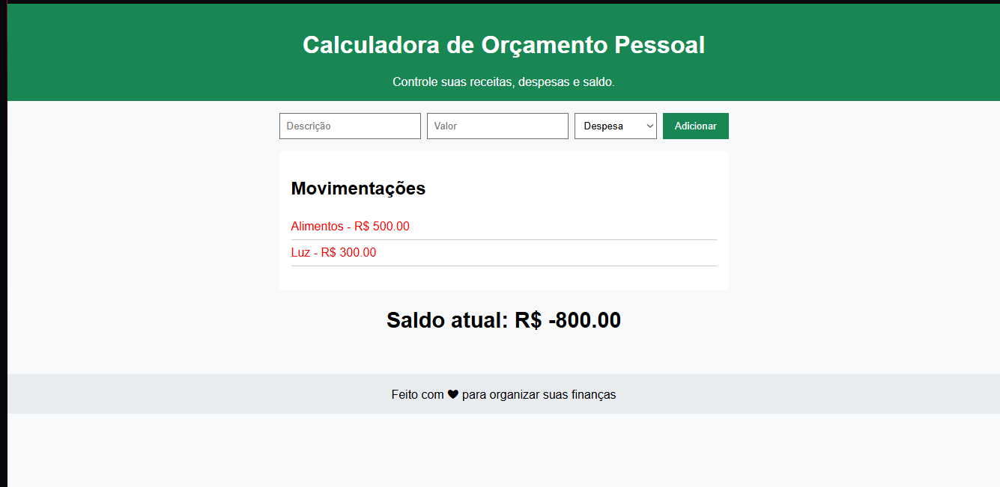

# calculadora-orcamento-pessoal
A aplicação permite que os usuários insiram informações sobre seus produtos e serviços, e realiza os cálculos necessários para determinar o custo total.

# 🧮 Calculadora de Orçamento Pessoal

> **Controle seus gastos, planeje seu mês e alcance seus objetivos financeiros!**

---

## ✨ Funcionalidades
- ➕ **Adicionar receitas** e ➖ **registrar despesas**  
- 📊 **Cálculo automático** do saldo  
- 📱 **Interface responsiva** (celular e computador)  
- 🎨 **Design limpo e fácil de usar**  

---

## 🚀 Como usar
1. Acesse: **[Clique aqui para usar agora](https://monica-1985.github.io/calculadora-orcamento-pessoal/)**  
2. Informe suas receitas e despesas  
3. Veja seu **saldo atualizado instantaneamente**  

---

## 🛠 Tecnologias utilizadas
- 🌐 **HTML5**  
- 🎨 **CSS3**  
- ⚡ **JavaScript**  

---

## 🎯 Objetivo
Facilitar o **controle financeiro pessoal**, incentivando hábitos saudáveis e um melhor planejamento mensal.

---

